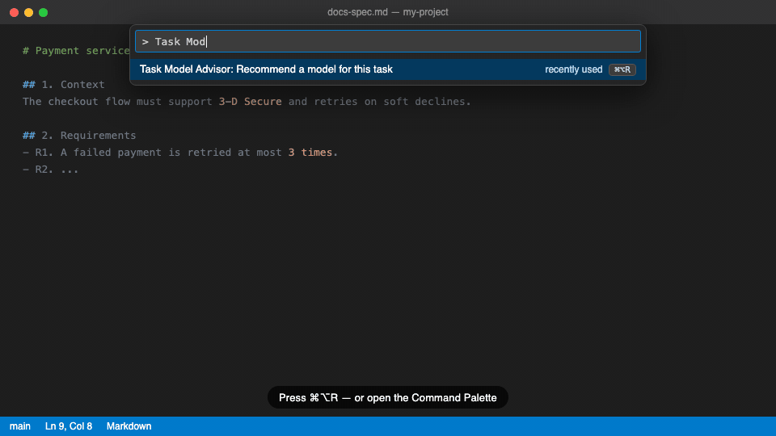

<h1 align="center">🧭 Task Model Advisor</h1>

  <strong>Stop guessing which model to pick.</strong> 
  Get the best <b>model</b>, <b>context window</b> and <b>thinking effort</b> for your next task — 
  ranked from live benchmarks, limited to the models <i>you can actually select</i> right now.

  
  
  
  

---

## The problem

Your editor offers 20+ models. Opus for a user story? A flash model for a spec? Max context for a 20-line script?
You either burn money on a frontier model for trivial work, or save pennies and get a mediocre result.

**Task Model Advisor does the homework for you, in one keystroke.**

## What you get

Pick a task, get your top 3:

  

<em>Illustrative flow. Real results depend on your session models and live benchmark data.</em>

Each recommendation shows the **model**, **context window tier**, and **thinking effort**, plus one sentence explaining _why_ it fits your task.

## Features

|                              |                                                                                                                                                             |
| ---------------------------- | ----------------------------------------------------------------------------------------------------------------------------------------------------------- |
| 🎯 **Task-aware**            | Presets for specs, user stories, test scenarios and Python scripts. Or describe anything with **Other** (_Autre_ in French) — the task is detected locally. |
| 📊 **Live benchmarks**       | [Artificial Analysis](https://artificialanalysis.ai/) intelligence / coding indices and pricing, plus Arena leaderboard rankings.                           |
| 🔒 **Only what you can use** | Never suggests a model that is not in your current session. No more "great, but I don't have access to it".                                                 |
| 💸 **Cost-aware**            | Frontier models don't win by default: price is part of the score, and a cheaper alternative is surfaced in the top 3 when it makes sense.                   |
| 🧠 **Thinking & context**    | Suggests a thinking effort and context tier per task, bumped for reasoning models and for "big repo" style requests.                                        |
| ⚡ **One-key workflow**      | `Cmd+Option+R` / `Ctrl+Alt+R`, pick a task, pick a model, done.                                                                                             |
| 🛟 **Always a fallback**     | If the host refuses to switch models, your full config is on the clipboard as JSON. If Arena is down, ranking continues without it.                         |

## Install

**From the Marketplace** (when published) — search for **Task Model Advisor** in the Extensions view.

**From a `.vsix`**

1. Download or build `task-model-advisor-*.vsix` (see [CONTRIBUTING.md](CONTRIBUTING.md)).
2. Command Palette → **Extensions: Install from VSIX…**
3. Select the file and reload if prompted.

## Quick start

**1. Add your keys.** On first launch the extension adds both settings (empty) to your User `settings.json` — just fill them in.

| Setting                                      | Required              | What for                                                                                               |
| -------------------------------------------- | --------------------- | ------------------------------------------------------------------------------------------------------ |
| `taskModelAdvisor.artificialAnalysis.apiKey` | **Yes**               | Benchmarks and pricing. Get a Data API key from [Artificial Analysis](https://artificialanalysis.ai/). |
| `taskModelAdvisor.cursor.apiKey`             | Cursor only, optional | Lists your Agent models. Create one in the [Cursor dashboard](https://cursor.com/dashboard).           |

> API keys live in your `settings.json` in plain text, like any other VS Code setting. Don't commit that file.

**2. Run the command.**

- Command Palette → **Task Model Advisor: Recommend a model for this task**
- or press `Cmd+Option+R` (macOS) · `Ctrl+Alt+R` (Windows / Linux)

**3. Pick and apply.** Choose a task, choose one of the top 3, then:

| Action                 | What it does                                                                                                   |
| ---------------------- | -------------------------------------------------------------------------------------------------------------- |
| **Apply**              | Copies the config, then tries to apply it. Cursor: best-effort auto-switch. VS Code: tells you what to select. |
| **Copy only**          | Copies the config as JSON to the clipboard. Nothing else.                                                      |
| **Refresh benchmarks** | Fetches benchmarks and session models again, then re-ranks.                                                    |

Set `taskModelAdvisor.language` to `fr` for French prompts. The default is `en`.

## Works where you work

| Host                         | Model discovery                                            | Validate                                                         |
| ---------------------------- | ---------------------------------------------------------- | ---------------------------------------------------------------- |
| **VS Code + GitHub Copilot** | Your Copilot chat models                                   | Copies config, shows what to select                              |
| **Cursor**                   | Cursor CLI (`agent`), then the Cursor API if you set a key | Copies config + best-effort switch of model, effort and Max Mode |

One package, no separate builds.

## Privacy

- Network requests happen **only** when you run the command or hit **Refresh** — never in the background.
- Your custom task text (**Other**) is processed **locally**. It is never sent to Artificial Analysis, Arena or anyone else.
- No telemetry. No prompt content leaves your machine.
- Each key only goes to its own service: the Artificial Analysis key to Artificial Analysis, the Cursor key to the Cursor CLI / API.

## Troubleshooting

| You see                                              | Why / what to do                                                                                                                                              |
| ---------------------------------------------------- | ------------------------------------------------------------------------------------------------------------------------------------------------------------- |
| `Artificial Analysis fetch failed (missing_api_key)` | Set `taskModelAdvisor.artificialAnalysis.apiKey`.                                                                                                             |
| `No chat models found in this session…`              | **Cursor:** set `taskModelAdvisor.cursor.apiKey`, or install the Cursor CLI and run `agent login`. **VS Code:** sign in to GitHub Copilot and open Chat once. |
| `Arena leaderboard unavailable…`                     | Expected when the mirror is down. Ranking continues with Artificial Analysis only.                                                                            |
| Validate didn't change the model                     | Cursor's switch is best-effort and can differ between builds. Your config is already on the clipboard — paste or apply it manually.                           |

## Good to know

- **Context window tiers** (`standard` / `medium` / `high`) are heuristic approximations of each host's UI labels.
- Rankings depend on third-party benchmark data. Treat them as a very good starting point, not an oracle.
- A model that cannot be linked to a benchmark is shown with the sentence `No reliable benchmark.`

## Go further

- 🔬 **How the ranking works, data sources, host behavior:** [CONTRIBUTING.md → How it works](CONTRIBUTING.md#how-it-works)
- 🛠 **Build, test, release:** [CONTRIBUTING.md](CONTRIBUTING.md)
